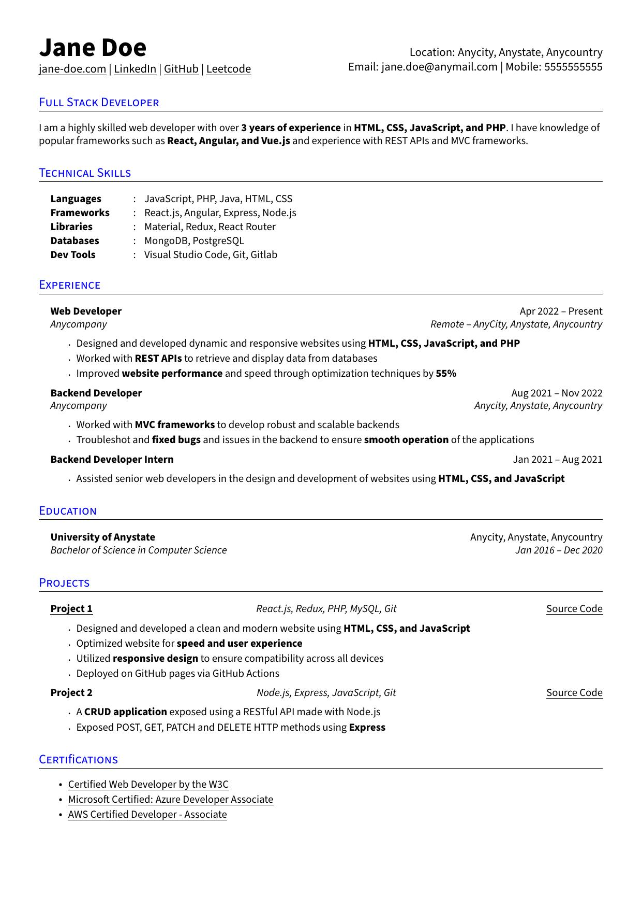

<a name="readme-top"></a>

[![MIT License][license-shield]][license-url]
[![LinkedIn][linkedin-shield]][linkedin-url]

<!-- Header -->
<br />
<div align="center">
  <a href="./rezume-logo.png">
    
  </a>

  <h3 align="center">Rezume</h3>

  <p align="center">
    An awesome LaTeX resume template to jumpstart your job search!
    <br />
    <br />
    <a href="https://www.overleaf.com/latex/templates/rezume/kfrvqywfkwjs">View on Overleaf</a>
    |
    <a href="https://github.com/nanupnch/Rezume/issues">Report Bug</a>
  </p>
</div>

<!-- TABLE OF CONTENTS -->
<details>
  <summary>Table of Contents</summary>
  <ol>
    <li>
      <a href="#about-the-project">About The Project</a>
    </li>
    <li>
      <a href="#getting-started">Getting Started</a>
      <ul>
        <li><a href="#prerequisites">Prerequisites</a></li>
      </ul>
    </li>
    <li><a href="#license">License</a></li>
    <li><a href="#contact">Contact</a></li>
    <li><a href="#acknowledgments">Acknowledgments</a></li>
  </ol>
</details>

<!-- ABOUT THE PROJECT -->

## About The Project

<div align="center">
  <a href="./rezume-preview.jpg">
      
  </a>
  <br />
  <br />
  <a href="./rezume.pdf">View Generated PDF</a>
</div>
<br />
There are many great LaTeX resume templates available on GitHub and Overleaf; however, I didn't find one that really suited my needs so I created this enhanced one. I want to create a resume template so amazing that it'll be the last one you ever need.

Here's what's in here:

- **Super clean layout**, looks sleek while being highly intuitive for glancing
- **Beginner friendly**, almost every command explained with comments
- **Customization**, pre-written commands and helpful comments for customization

Of course, no one template will serve all purposes since your needs may be different. You may suggest changes by forking this repo and creating a pull request or opening an issue.

Use the `rezume.tex` to get started.

<!-- GETTING STARTED -->

## Getting Started

### Prerequisites

Install a LaTeX distribution and `latexmk`. **pdfLaTeX is the default compiler**; XeLaTeX and LuaLaTeX are also supported. The template uses Source Sans Pro. Its pdfLaTeX font support also needs the `ly1` and `mweights` packages, plus `ulem` and the other packages listed in `rezume.tex`.

On Debian or Ubuntu:

```sh
sudo apt-get update
sudo apt-get install --no-install-recommends make latexmk texlive-latex-extra \
  texlive-fonts-recommended texlive-fonts-extra texlive-plain-generic
```

For the optional compilers, also install `texlive-xetex` and `texlive-luatex`. The full [MacTeX](https://www.tug.org/mactex/) distribution includes these tools on macOS. On Windows, use [MiKTeX](https://miktex.org/), install missing packages through MiKTeX Console, and run the `latexmk` command below from the repository directory. MiKTeX's `latexmk` also requires Perl, such as [Strawberry Perl](https://strawberryperl.com/).

### Build and customize

Edit `rezume.tex`, replacing the example name, contact details, project links, and certification links with your own. Build from the repository directory:

```sh
make build
```

The PDF is written to `build/pdflatex/rezume.pdf`. To build without Make:

```sh
latexmk -pdf -synctex=1 -interaction=nonstopmode -halt-on-error -file-line-error \
  -outdir=build/pdflatex rezume.tex
```

Select another compiler with `make build ENGINE=xelatex` or `make build ENGINE=lualatex`. Each compiler has its own output directory under `build/`. `make clean` removes the selected compiler's PDF and auxiliary files. Local build outputs, including SyncTeX, are ignored by Git; the root PDF and preview image are published samples.

Long contact details and heading text wrap within their columns. When adding content, check the generated PDF for line wrapping and pagination. Unicode mappings support text extraction, but they do not guarantee compatibility with every applicant tracking system or produce a tagged, accessible PDF.

### Development checks and sample updates

The checks require Python 3.9 or newer and the dependency in `requirements-dev.txt`. Debian and Ubuntu users also need `python3-venv` (`sudo apt-get install python3-venv`). On Linux or macOS:

```sh
python3 -m venv .venv
. .venv/bin/activate
python -m pip install -r requirements-dev.txt
make check
```

On Windows, create the environment with `py -3 -m venv .venv`, activate it in Command Prompt with `.venv\Scripts\activate`, and run `python -m pip install -r requirements-dev.txt`. After the `latexmk` build above, you can run the checks without Make using `python -m unittest discover -s tests -v`.

Run `make check ENGINE=xelatex` and `make check ENGINE=lualatex` to test the other compilers. The checks compile the sample and longer contact and heading examples, verify PDF content and hyperlinks, reject layout warnings, and confirm that font-size changes stay within their intended blocks. GitHub Actions runs them with all three compilers.

Maintainers can refresh the checked-in sample PDF and image with `make sample`. This target also requires Poppler's `pdftoppm` (`sudo apt-get install poppler-utils` on Debian or Ubuntu). Review the generated samples before committing them.

<!-- LICENSE -->

## License

Distributed under the MIT License. See [LICENSE.txt](./LICENSE.txt) for the Rezume and upstream copyright notices.

<!-- CONTACT -->

## Contact

Nanu Panchamurthy - nanup.personal@gmail.com

Project Link: [https://github.com/nanupnch/Rezume](https://github.com/nanupnch/Rezume)

<!-- ACKNOWLEDGMENTS -->

## Acknowledgments

- Based on [sb2nov/resume](https://github.com/sb2nov/resume/)
- [Choose an Open Source License](https://choosealicense.com)

<p align="right">(<a href="#readme-top">back to top</a>)</p>

[license-shield]: https://img.shields.io/github/license/nanupnch/Rezume.svg?style=for-the-badge
[license-url]: ./LICENSE.txt
[linkedin-shield]: https://img.shields.io/badge/-LinkedIn-black.svg?style=for-the-badge&logo=linkedin&colorB=555
[linkedin-url]: https://linkedin.com/in/nanu-panchamurthy
